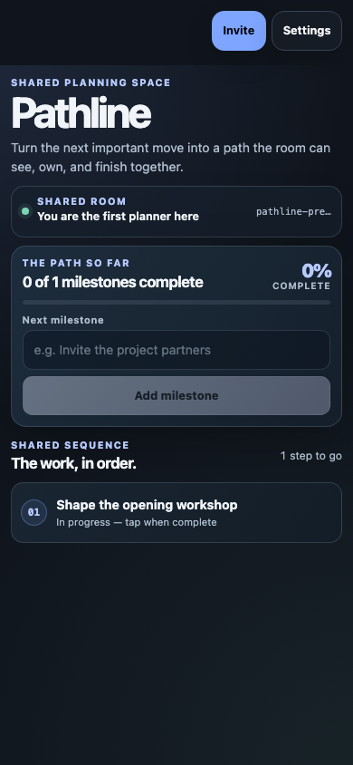

# Pathline

Pathline is a calm shared planning room: name the next move, let everyone see
the same sequence, and mark progress together without a central app backend.

**Live:** https://baditaflorin.github.io/mesh-milestone-map/



## How it works

1. Open the same room with the people planning the work.
2. Add milestones in the order the work needs to happen.
3. Anyone in the room can mark a milestone complete; the shared Yjs array
   propagates the same state to every peer.

The product-facing name is Pathline. Its existing room namespace remains
unchanged so current shared plans and existing room links continue to meet the
same peer-to-peer document.

## Experience contract

- **A real first decision.** The next-milestone field and its create action
  remain visible at `390×844` and `1141×602`.
- **Truthful shared state.** Before a room exists, the UI says it is preparing
  the room; after it exists, it reports the actual awareness peer count rather
  than a fabricated connection claim.
- **Accessible planning.** The milestone field, completion controls, progress
  bar, and Settings drawer have semantic labels and keyboard coverage.
- **Peer-to-peer by design.** There is no app backend. The list and completion
  state use the real `useSharedMilestones` Yjs CRDT path.

## Development

`mesh-common` must be a sibling checkout because this app uses its local
package.

```bash
npm ci
npm run fmt:check
npm run typecheck
npm run test:unit
npm run smoke
CI=true npm run test
```

Pages publishes committed `docs/` from `main`. The root `.woodpecker.yml`
runs the equivalent clean-install gate in fleet CI. The release dependency and
secret-scan results are recorded in
[docs/security-audit-2026-08-26.md](docs/security-audit-2026-08-26.md).
